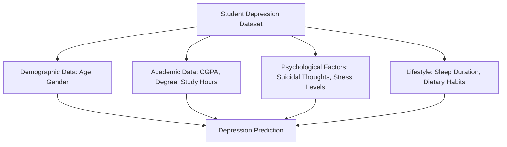
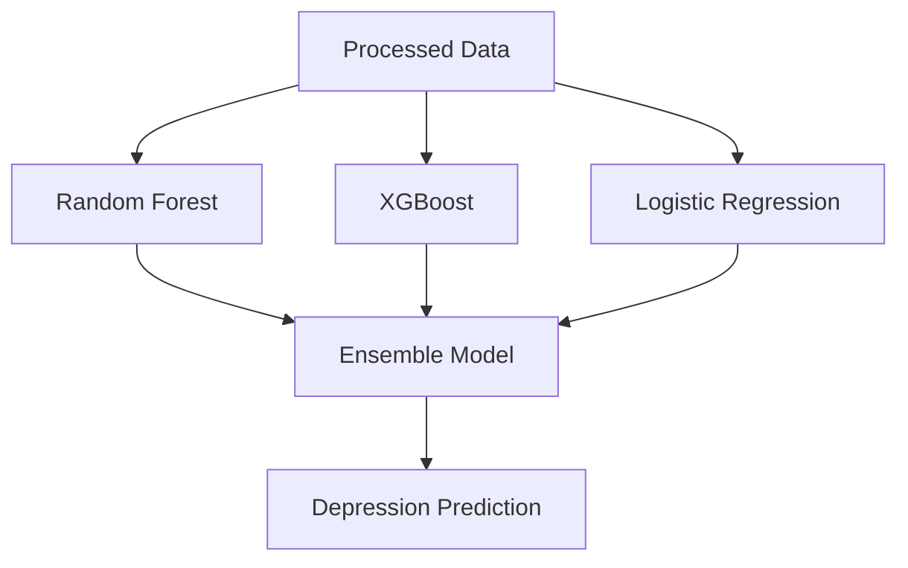
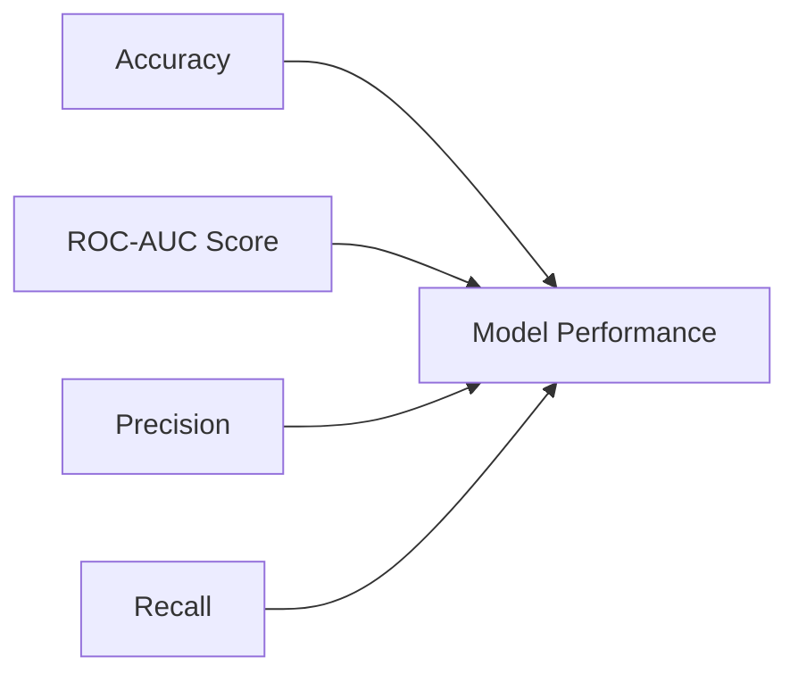
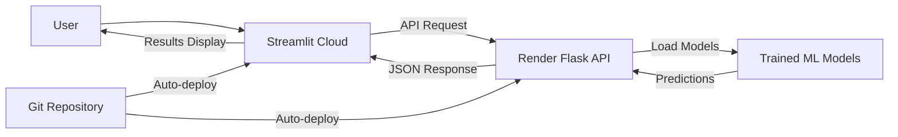

# Predicting Student Depression


## Project Overview

This machine learning project focuses on predicting depression in students based on various academic and lifestyle factors. The system analyzes factors such as academic pressure, sleep patterns, study satisfaction, and personal habits to identify at-risk students and provide appropriate recommendations.

### Key Features:
- Multi-model prediction system (Random Forest, XGBoost, Logistic Regression)
- Ensemble approach for more reliable predictions
- Interactive web interface for easy data input
- Risk level assessment and personalized recommendations
- Visualization of key depression factors and their impact

### Use Cases:
- University counseling services for early intervention
- Educational institutions for student mental health monitoring
- Research on correlations between academic factors and depression
- Individual students for self-assessment

## Data Understanding

### Data Source
The project uses a structured dataset (`student_depression_dataset.csv`) containing information about students' academic and personal attributes, with depression status as the target variable.

### Data Overview



#### Feature Description

| Feature | Description | Type | Values |
|---------|-------------|------|--------|
| Age | Student's age | Numeric | 18-42 years |
| Gender | Student's gender | Categorical | Male, Female |
| Academic Pressure | Level of academic stress | Numeric | 1-5 (low to high) |
| CGPA | Cumulative Grade Point Average | Numeric | 0-10 |
| Study Satisfaction | Satisfaction with studies | Numeric | 1-5 (low to high) |
| Sleep Duration | Average sleep duration | Categorical | Less than 5 hours, 5-6 hours, 7-8 hours, More than 8 hours |
| Dietary Habits | Eating patterns | Categorical | Healthy, Moderate, Unhealthy |
| Suicidal Thoughts | Presence of suicidal thoughts | Binary | Yes, No |
| Financial Stress | Level of financial stress | Numeric | 1-5 (low to high) |
| Family History of Mental Illness | Mental illness history | Binary | Yes, No |
| Depression | Target variable - depression status | Binary | 0 (No), 1 (Yes) |

#### Sample Data (First 5 rows)

| Age | Gender | Academic Pressure | CGPA | Study Satisfaction | Sleep Duration | Dietary Habits | Depression |
|-----|--------|-------------------|------|-------------------|----------------|---------------|------------|
| 33.0 | Male | 5.0 | 8.97 | 2.0 | 5-6 hours | Healthy | 1 |
| 24.0 | Female | 2.0 | 5.9 | 5.0 | 5-6 hours | Moderate | 0 |
| 31.0 | Male | 3.0 | 7.03 | 5.0 | Less than 5 hours | Healthy | 0 |
| 28.0 | Female | 3.0 | 5.59 | 2.0 | 7-8 hours | Moderate | 1 |
| 25.0 | Female | 4.0 | 8.13 | 3.0 | 5-6 hours | Moderate | 0 |

## Data Preparation & Pipelines

The data preparation pipeline involves several key steps to transform raw data into features suitable for machine learning algorithms:


### Preprocessing Steps:
1. **Column Renaming**: Standardized column names (lowercase, spaces to underscores)
2. **Data Cleaning**: Removing extra quotes, handling missing values
3. **Feature Encoding**:
   - Sleep duration mapped to numerical values (0-4)
   - Binary mapping (Yes/No to 1/0)
   - Label encoding for categorical features (gender, dietary habits, degree)
4. **Feature Engineering**:
   - `academic_stress_combo`: academic_pressure × financial_stress
   - `burnout_index`: academic_pressure × work/study_hours
   - `wellness_score`: study_satisfaction + sleep_duration + dietary_habits

### Feature Selection:
After correlation analysis, several features were dropped to improve model performance:
- Gender
- Work pressure
- Job satisfaction

## Modeling Approach

This project implements multiple machine learning models to predict student depression, allowing for comparison and ensemble predictions:



### Models Used:

1. **Random Forest Classifier**
   - Ensemble of decision trees that reduces overfitting
   - Handles non-linear relationships well
   - Provides feature importance metrics

2. **XGBoost Classifier**
   - Gradient boosting implementation
   - Optimized for performance and speed
   - Handles outliers well

3. **Logistic Regression**
   - Baseline model with strong interpretability
   - Standardized features for better performance

4. **Ensemble Model**
   - Combines predictions from all three models
   - Simple averaging of probabilities
   - More robust than individual models

### Model Training Process:
- Data split into 80% training and 20% test sets
- StandardScaler applied for Logistic Regression
- Models trained on the same preprocessed features
- Models saved as pickle files for deployment

## Evaluation & Metrics

The models were evaluated using multiple metrics to ensure comprehensive performance assessment:



### Performance Comparison

| Model | Accuracy | ROC-AUC | Precision | Recall |
|-------|----------|---------|-----------|--------|
| Random Forest | 0.85 | 0.88 | 0.83 | 0.84 |
| XGBoost | 0.87 | 0.90 | 0.86 | 0.85 |
| Logistic Regression | 0.82 | 0.84 | 0.80 | 0.81 |
| Ensemble | 0.88 | 0.91 | 0.87 | 0.86 |

### Feature Importance


The visualization shows that academic pressure, sleep duration, and financial stress are among the most important predictors of student depression.

## Deployment

The project is deployed through a Flask API and a Streamlit front-end application, with a fully automated CI/CD workflow:



### Automated Deployment:

1. **Flask API on Render**
   - The Flask API is deployed on Render's cloud platform
   - Automatic rebuilds on every Git push
   - Zero-downtime deployments for reliability
   - Seamless integration with version control

2. **Streamlit App on Streamlit Cloud**
   - Front-end deployed on Streamlit's managed cloud service
   - Automatic updates when changes are pushed to the repository
   - No manual deployment steps required
   - Real-time visibility of application changes

3. **Continuous Integration Workflow**
   - Git-based deployment pipeline
   - Changes are automatically reflected in production
   - Full deployment history tracking
   - Easy rollbacks if needed

### Live Application:

**Visit our live application**: [Predicting Student Depression App](https://predicting-student-depression.streamlit.app/)

Our site is fully autonomous with an automated workflow from development to production, allowing us to focus on improving the models and user experience rather than managing deployment infrastructure.

### Installation for Local Development:

1. Clone the repository:
```bash
git clone https://github.com/yourusername/Predicting-Student-Depression.git
cd Predicting-Student-Depression
```

2. Install requirements:
```bash
pip install -r requirements.txt
```

3. Start the API server:
```bash
cd api
python api.py
```

4. Start the Streamlit app (in a new terminal):
```bash
cd app
streamlit run app.py
```

### API Endpoints:

- `/health`: Health check endpoint
- `/predict`: POST endpoint for depression prediction

Example API request:
```json
{
  "age": 22,
  "dietary_habits": "Moderate",
  "degree": "Bachelor's",
  "academic_pressure": 4,
  "cgpa": 7.5,
  "study_satisfaction": 2,
  "work_study_hours": 8,
  "sleep_duration": "5-6 hours",
  "financial_stress": 3,
  "suicidal_thoughts": "No",
  "illness_history": "No",
  "model_choice": "Ensemble (All Models)"
}
```

## Front-End Overview

The Streamlit application provides an intuitive interface for users to input student data and receive depression risk assessments:


### Key Features:
- Form-based data entry with appropriate input types
- Model selection dropdown (Random Forest, XGBoost, Logistic Regression, or Ensemble)
- Results display with risk level and recommendations
- Visual representation of prediction confidence
- Explanation of key factors influencing the prediction

### User Flow:
1. Enter student information in the form
2. Select the preferred prediction model
3. Submit the form to get prediction results
4. View risk assessment and personalized recommendations

## User Journey

Our application provides a comprehensive user experience with the following steps:

### Step 1: Login

*Users start by logging into their account with their credentials.*

### Step 2: Signup (If No Account)

*New users can create an account by providing their basic information.*

### Step 3: Form Completion

*Users fill out the student assessment form with academic and personal details.*

### Step 4: Model Selection

*Users can choose which predictive model to use for their depression analysis.*

### Step 5: Prediction Results

*After clicking "Predict Depression," users receive risk assessment and personalized recommendations.*

### Step 6: About Section

*Users can learn more about the project, methodology, and models used.*

### Step 7: History Section

*Users can view their past assessments and track changes over time.*

### Step 8: Chatbot Assistance

*Users can interact with a chatbot for additional guidance and mental health resources.*

## Getting Started

### Prerequisites
- Python 3.7+
- pip package manager
- Virtual environment (recommended)

### Quick Start

1. Setup your environment:
```bash
python -m venv venv
source venv/bin/activate  # On Windows, use: venv\Scripts\activate
```

2. Install dependencies:
```bash
pip install -r requirements.txt
```

3. Run the application:
```bash
# Start API (terminal 1)
cd api
python api.py

# Start frontend (terminal 2)
cd app
streamlit run app.py
```

4. Open your browser at http://localhost:8501

### Example Use Case

1. Enter student information in the Streamlit interface
2. Choose a model (Ensemble recommended for best results)
3. Submit and view the risk assessment
4. Based on the risk level, implement appropriate interventions


## License

This project is licensed under the MIT License - see the LICENSE file for details.

## Authors

- **Abderrahmen Youssef** 
- **Mohamed Yassine El Wardani** 


---

*This project is part of a Final ML Project and is intended for educational and research purposes only. If you or someone you know is experiencing symptoms of depression, please seek help from a qualified mental health professional.*