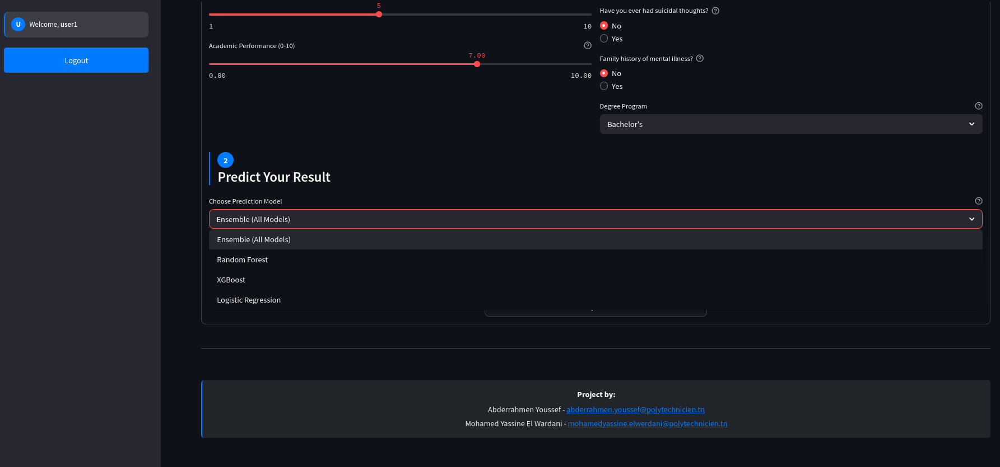

# Predicting Student Depression


## Project Overview

This machine learning project focuses on predicting depression in students based on various academic and lifestyle factors. The system analyzes factors such as academic pressure, sleep patterns, study satisfaction, and personal habits to identify at-risk students and provide appropriate recommendations.

### Key Features:
- Multi-model prediction system (Random Forest, XGBoost, Logistic Regression)
- Interactive web interface for easy data input
- Risk level assessment and personalized recommendations
- Visualization of key depression factors and their impact

### Use Cases:
- University counseling services for early intervention
- Educational institutions for student mental health monitoring
- Research on correlations between academic factors and depression
- Individual students for self-assessment

### Live Application:

**Visit our live application**: [Predicting Student Depression App](https://predicting-student-depression.streamlit.app/)

Our site is fully autonomous with an automated workflow from development to production, allowing us to focus on improving the models and user experience rather than managing deployment infrastructure.

## Data Understanding

### Data Source
The project uses a structured dataset (`student_depression_dataset.csv`) from Kaggle containing information about students' academic and personal attributes, with depression status as the target variable.

**Kaggle Dataset Source**: [Student Depression Dataset](https://www.kaggle.com/datasets/adilshamim8/student-depression-dataset)

### Data Overview


#### Feature Description

| Feature | Description | Type | Values |
|---------|-------------|------|--------|
| Gender | Student's gender | Categorical | Male or Female |
| Age | Student's age | Numeric | Numerical (18-39 years) |
| City | Student's location | Categorical | Geographical location |
| Profession | Student's occupation | Categorical | Student or specific profession |
| Academic Pressure | Level of academic stress | Numeric | Scale 1-5 (1=low, 5=high) |
| Work Pressure | Level of professional stress | Numeric | Scale 0-5 (0=none, 5=high) |
| CGPA | Cumulative Grade Point Average | Numeric | Academic performance (0-10 scale) |
| Study Satisfaction | Satisfaction with studies | Numeric | Scale 1-5 (1=low, 5=high) |
| Job Satisfaction | Satisfaction with job | Numeric | Scale 0-5 (0=none, 5=high) |
| Sleep Duration | Average sleep duration | Categorical | Categories (Less than 5hrs to 8+ hrs) |
| Dietary Habits | Eating patterns | Categorical | Healthy, Moderate, Unhealthy |
| Degree | Education qualification | Categorical | Academic degree being pursued |
| Suicidal Thoughts | Presence of suicidal thoughts | Binary | Yes/No binary indicator |
| Work/Study Hours | Hours spent on work/study | Numeric | Daily hours spent (0-12) |
| Financial Stress | Level of financial stress | Numeric | Scale 1-5 (1=low, 5=high) |
| Family History of Mental Illness | Mental illness history | Binary | Yes/No binary indicator |
| Depression | Target variable - depression status | Binary | Target variable (0=No, 1=Yes) |

#### Sample Data (First 5 rows)

| id | Gender | Age | City | Profession | Academic Pressure | Work Pressure | CGPA | Study Satisfaction | Job Satisfaction | Sleep Duration | Dietary Habits | Degree | Suicidal Thoughts | Work/Study Hours | Financial Stress | Illness History | Depression |
|----|--------|-----|------|------------|-------------------|---------------|------|-------------------|------------------|----------------|---------------|--------|------------------|-----------------|-----------------|----------------|------------|
| 2 | Male | 33.0 | Visakhapatnam | Student | 5.0 | 0.0 | 8.97 | 2.0 | 0.0 | 5-6 hours | Healthy | B.Pharm | Yes | 3.0 | 1.0 | No | 1 |
| 8 | Female | 24.0 | Bangalore | Student | 2.0 | 0.0 | 5.90 | 5.0 | 0.0 | 5-6 hours | Moderate | BSc | No | 3.0 | 2.0 | Yes | 0 |
| 26 | Male | 31.0 | Srinagar | Student | 3.0 | 0.0 | 7.03 | 5.0 | 0.0 | Less than 5 hours | Healthy | BA | No | 9.0 | 1.0 | Yes | 0 |
| 30 | Female | 28.0 | Varanasi | Student | 3.0 | 0.0 | 5.59 | 2.0 | 0.0 | 7-8 hours | Moderate | BCA | Yes | 4.0 | 5.0 | Yes | 1 |
| 32 | Female | 25.0 | Jaipur | Student | 4.0 | 0.0 | 8.13 | 3.0 | 0.0 | 5-6 hours | Moderate | M.Tech | Yes | 1.0 | 1.0 | No | 0 |

## Data Preparation & Pipelines

The data preparation pipeline involves several key steps to transform raw data into features suitable for machine learning algorithms:


### Preprocessing Steps:
1. **Column Renaming**: Standardized column names (lowercase, spaces to underscores)
2. **Data Cleaning**: Removing extra quotes, handling missing values
3. **Feature Encoding**:
   - Sleep duration mapped to numerical values (0-4)
   - Binary mapping (Yes/No to 1/0)
   - Label encoding for categorical features (gender, dietary habits, degree)
4. **Feature Engineering**:
   - `academic_stress_combo`: academic_pressure × financial_stress
   - `burnout_index`: academic_pressure × work/study_hours
   - `wellness_score`: study_satisfaction + sleep_duration + dietary_habits

### Feature Selection:
After correlation analysis, several features were dropped to improve model performance:
- Gender
- Work pressure
- Job satisfaction


## Modeling Approach

This project implements multiple machine learning models to predict student depression:


### Models Used:

1. **Random Forest Classifier**
   - Ensemble of decision trees that reduces overfitting
   - Handles non-linear relationships well
   - Provides feature importance metrics

2. **XGBoost Classifier**
   - Gradient boosting implementation
   - Optimized for performance and speed
   - Handles outliers well

3. **Logistic Regression**
   - Baseline model with strong interpretability
   - Standardized features for better performance

### Model Training Process:
- Data split into 80% training and 20% test sets
- StandardScaler applied for Logistic Regression
- Models trained on the same preprocessed features
- Models saved as pickle files for deployment

## Evaluation & Metrics

The models were evaluated using multiple metrics to ensure comprehensive performance assessment:


### Performance Comparison


#### Performance Analysis

Based on the performance metrics shown above, we can conclude that:

1. **XGBoost** demonstrates the best overall performance with the highest accuracy (0.8389) and ROC-AUC score (0.9140). Its superior precision and good recall indicate it excels at correctly identifying both depressed and non-depressed students.

2. **Logistic Regression**, despite its simplicity, performs remarkably well with an accuracy of 0.8371 and ROC-AUC of 0.9136, showing that even simple models can be effective for this classification task when features are properly engineered.

3. **Random Forest** provides solid performance (accuracy 0.8357, ROC-AUC 0.9103) with the added benefit of better interpretability through feature importance metrics.

4. All models achieve ROC-AUC scores above 0.91, indicating excellent discriminative power in distinguishing between depressed and non-depressed students.

5. The precision-recall trade-off is well-balanced across all models, with slightly higher recall than precision, which is appropriate for this use case where identifying at-risk students (minimizing false negatives) is generally more important than avoiding false alarms.

### Feature Importance


The visualization shows that suicidal thoughts, academic pressure, sleep duration, and financial stress are among the most important predictors of student depression.

## Chatbot & Fine-Tuning

The application includes an integrated mental health support chatbot that provides students with guidance, coping strategies, and resources.


### Integration Architecture

The chatbot leverages OpenRouter's API to access state-of-the-art language models specifically designed for mental health support:

1. **API Connection**: The application connects to OpenRouter using secure API authentication
2. **System Prompt Engineering**: Custom prompt ensures responses are compassionate, evidence-based, and appropriate for mental health contexts
3. **Contextual Memory**: The chatbot maintains conversation history to provide coherent, personalized responses
4. **Crisis Response Protocol**: Built-in recognition of crisis language that triggers appropriate resource recommendations

### Fine-Tuning Details

The chatbot uses a specialized model for mental health support with the following characteristics:

**Custom System Prompt**: 
```
You are a supportive, empathetic, and knowledgeable AI assistant specializing in student mental health. 
Your purpose is to provide guidance, coping strategies, and mental health support for students experiencing 
depression, anxiety, academic stress, or seeking general mental wellness advice. Your responses should be 
compassionate, evidence-based, and appropriate for someone who may be experiencing mental health challenges. 
If a user appears to be in crisis, always encourage them to seek professional help while providing immediate 
supportive responses.
```

### Example Interactions

**Example 1: Stress Management**
```
Student: "I'm feeling really overwhelmed with my coursework right now."

Chatbot: "I understand how overwhelming coursework can feel. Consider breaking down large tasks into smaller, 
manageable steps and prioritizing what needs immediate attention. Taking short breaks using techniques like 
the Pomodoro method (25 minutes of work followed by a 5-minute break) can also help maintain focus without 
burning out. Would you like some specific strategies for your particular situation?"
```

**Example 2: Crisis Support**
```
Student: "I don't see any point in continuing anymore."

Chatbot: "I hear that you're going through something really difficult right now. These feelings are important 
to address, and you deserve support. Please consider reaching out to a mental health professional who can 
provide immediate help - you can text or call the 988 Suicide & Crisis Lifeline (call or text 988) anytime. 
They have trained counselors available 24/7. Would it be possible for you to speak with someone you trust 
about how you're feeling right now?"
```

The chatbot is designed as a supportive resource but always encourages seeking professional help for serious mental health concerns.

## Deployment

The project is deployed through a Flask API and a Streamlit front-end application, with a fully automated CI/CD workflow:


### Automated Deployment:

1. **Flask API on Render**
   - The Flask API is deployed on Render's cloud platform
   - Automatic rebuilds on every Git push
   - Zero-downtime deployments for reliability
   - Seamless integration with version control

2. **Streamlit App on Streamlit Cloud**
   - Front-end deployed on Streamlit's managed cloud service
   - Automatic updates when changes are pushed to the repository
   - No manual deployment steps required
   - Real-time visibility of application changes

3. **Continuous Integration Workflow**
   - Git-based deployment pipeline
   - Changes are automatically reflected in production
   - Full deployment history tracking
   - Easy rollbacks if needed

### Installation for Local Development:

1. Clone the repository:
```bash
git clone https://github.com/yourusername/Predicting-Student-Depression.git
cd Predicting-Student-Depression
```

2. Install requirements:
```bash
pip install -r requirements.txt
```

3. Start the API server:
```bash
cd api
python api.py
```

4. Start the Streamlit app (in a new terminal):
```bash
cd app
streamlit run app.py
```

### API Endpoints:

- `/health`: Health check endpoint
- `/predict`: POST endpoint for depression prediction

Example API request:
```json
{
  "age": 22,
  "dietary_habits": "Moderate",
  "degree": "Bachelor's",
  "academic_pressure": 4,
  "cgpa": 7.5,
  "study_satisfaction": 2,
  "work_study_hours": 8,
  "sleep_duration": "5-6 hours",
  "financial_stress": 3,
  "suicidal_thoughts": "No",
  "illness_history": "No",
  "model_choice": "Logistic Regression"
}
```

## Front-End Overview

The Streamlit application provides an intuitive interface for users to input student data and receive depression risk assessments:


### Key Features:
- Form-based data entry with appropriate input types
- Model selection dropdown (Random Forest, XGBoost, Logistic Regression)
- Results display with risk level and recommendations
- Visual representation of prediction confidence
- Explanation of key factors influencing the prediction

### User Flow:
1. Enter student information in the form
2. Select the preferred prediction model
3. Submit the form to get prediction results
4. View risk assessment and personalized recommendations

## User Journey

Our application provides a comprehensive user experience with the following steps:

### Step 1: Login

*Users start by logging into their account with their credentials.*

### Step 2: Signup (If No Account)

*New users can create an account by providing their basic information.*

### Step 3: Form Completion

*Users fill out the student assessment form with academic and personal details.*

### Step 4: Model Selection

*Users can choose which predictive model to use for their depression analysis.*

### Step 5: Prediction Results

*After clicking "Predict Depression," users receive risk assessment and personalized recommendations.*

### Step 6: About Section

*Users can learn more about the project, methodology, and models used.*

### Step 7: History Section

*Users can view their past assessments and track changes over time.*

### Step 8: Chatbot Assistance

*Users can interact with a chatbot for additional guidance and mental health resources.*

## Getting Started

### Prerequisites
- Python 3.7+
- pip package manager
- Virtual environment (recommended)

### Quick Start

1. Setup your environment:
```bash
python -m venv venv
source venv/bin/activate  # On Windows, use: venv\Scripts\activate
```

2. Install dependencies:
```bash
pip install -r requirements.txt
```

3. Run the application:
```bash
# Start API (terminal 1)
cd api
python api.py

# Start frontend (terminal 2)
cd app
streamlit run app.py
```

4. Open your browser at http://localhost:8501

### Example Use Case

1. Enter student information in the Streamlit interface
2. Choose a model (Logistic Regression recommended for best results)
3. Submit and view the risk assessment
4. Based on the risk level, implement appropriate interventions


## License

This project is licensed under the MIT License - see the LICENSE file for details.

## Authors

- **Abderrahmen Youssef** 
- **Mohamed Yassine El Wardani** 


---

*This project is part of a Final ML Project and is intended for educational and research purposes only. If you or someone you know is experiencing symptoms of depression, please seek help from a qualified mental health professional.*